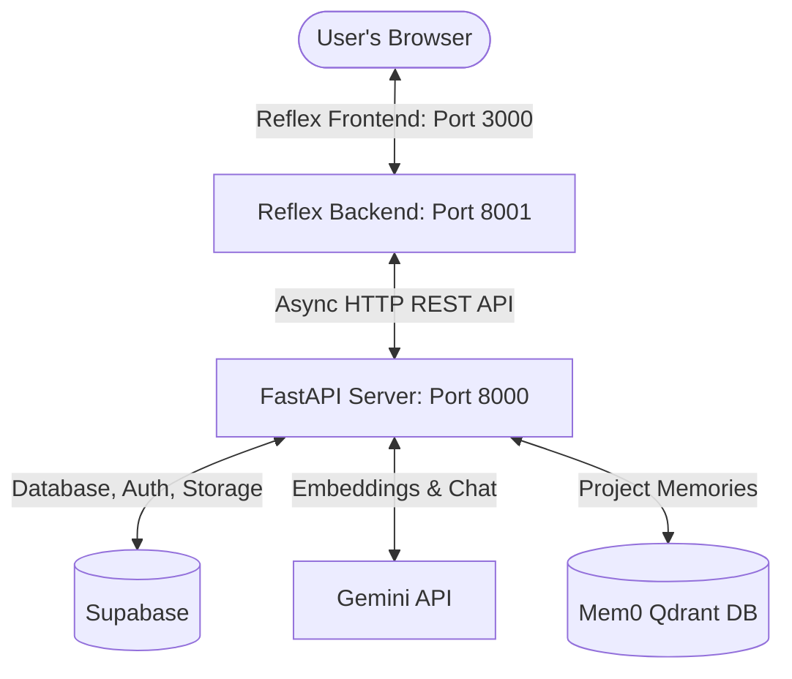

# SceneForge — Project Documentation & Architectural Details

SceneForge is a state-of-the-art, **RAG-powered film research chatbot** designed for filmmakers, screenwriters, and researchers to securely query screenplays, books, and reference PDFs. It delivers fully grounded, zero-hallucination answers backed by inline, hoverable citations, combining long-term contextual memory, hybrid search, and rate-limiting.

---

## 1. System Architecture

SceneForge employs a decoupled, multi-tier architecture designed for low-latency operations and complete namespace isolation:



### Components
1. **Reflex Frontend (Ports 3000 & 8001):** A high-fidelity, glassmorphic client interface built in Python using Reflex (wrapping React/Next.js). It handles user sessions, project navigation, asynchronous PDF uploading with progress bars, and rich messaging with hoverable source tooltips.
2. **FastAPI Backend (Port 8000):** A Python API server containing 11 secure REST endpoints. Offloads heavy parsing, embeddings generation, vector matches, and background persistence.
3. **Supabase (PostgreSQL + pgvector):** Manages user accounts (auth.users), stores project and document metadata, and maintains a highly indexed vector store (`document_chunks`) for document segments.
4. **Google Gemini API:** 
   - **Generation:** `gemini-2.5-flash` model produces deterministic, grounded answers based strictly on retrieved chunks.
   - **Embeddings:** `models/gemini-embedding-001` or `models/text-embedding-004` yields 768-dimensional semantic vectors.
5. **Mem0 Contextual Memory:** A Qdrant-backed local storage engine that records and recalls cross-session project facts, eliminating context loss between chat sessions.

---

## 2. Color Palette & UI Design System

SceneForge uses a curated, premium dark-mode design system with high-fidelity glassmorphism, smooth animations, and neon/gradient accent markers:

| Component | Target Color / Style | Code Representation / Usage |
| :--- | :--- | :--- |
| **Primary Canvas Background** | Midnight Obsidian | `#06060c` / `#080810` |
| **Grounded Text** | Off-White / Zinc-100 | `#f4f4f5` |
| **Muted Labels & Metadata** | Zinc-400 | `rgba(161, 161, 170, 0.7)` |
| **Glassmorphic Cards & Panels** | Translucent Slate | `rgba(14, 14, 24, 0.65)` with `1px solid rgba(255, 255, 255, 0.07)` border & `backdrop-filter: blur(24px) saturate(1.4)` |
| **Primary Accent & Gradients** | Indigo to Purple | `linear-gradient(135deg, rgba(99, 102, 241, 0.15) 0%, rgba(168, 85, 247, 0.12) 100%)` |
| **Focus Highlights & Glow Rings** | Indigo Core | Border: `rgba(99, 102, 241, 0.5)`, Shadow Glow: `rgba(99, 102, 241, 0.12)` |
| **Secondary Accent Glow** | Cyan / Electric Teal | `rgba(34, 211, 238, 0.3)` |
| **Text Highlights & Citations** | Gold / Amber | Background: `rgba(234, 179, 8, 0.3)`, Border: `rgba(234, 179, 8, 0.5)` |
| **Interactive Scrollbars** | Indigo Scroll Track | Thumb: `rgba(99, 102, 241, 0.2)` (hover: `rgba(99, 102, 241, 0.45)`) |

### UI Design Principles
- **Glassmorphism:** Central content containers use stacked blur (`backdrop-filter`) and low-opacity borders to create layers of depth.
- **Micro-animations:** Glow rings, slide-ins, and page fades use customized cubic-beziers (`cubic-bezier(0.16, 1, 0.3, 1)`) for premium responsiveness.
- **Cyber-grid Overlays:** Visual background spacing utilizes grid lines with a opacity of `0.015` to preserve screen real estate readability.

---

## 3. Technical Capabilities & Flowcharts

### 3.1 PDF Processing Pipeline
When a user uploads a script or research document, SceneForge processes it asynchronously to ensure responsiveness:

```
PDF File Upload
  │
  ▼
Validate File (Extension check & %PDF magic bytes check)
  │
  ▼
FastAPI Background Task Triggered
  │
  ▼
PyMuPDF (fitz) page-by-page text extraction (skips blank pages)
  │
  ▼
Sliding-Window Word Chunker (500 words per chunk, 50-word overlap)
  │
  ▼
Batch Embed Chunks (up to 100 chunks per batch using Gemini API)
  │
  ▼
Batch Database Insert (up to 500 records per query into Supabase)
  │
  ▼
Update Document status to 'ready'
```

### 3.2 RAG Chat & Hybrid Search
To achieve maximum citation recall and eliminate hallucinations, SceneForge implements hybrid retrieval:

```
User Query
  │
  ▼
Parallel Execution:
  ├── Query Expansion: Generate Hypothetical Document Embeddings (HyDE)
  └── Fetch Long-Term Memory (Mem0)
  │
  ▼
Retrieve Chunks via Hybrid Retrieval:
  ├── Vector Similarity Search: Cosine similarity via match_chunks() RPC (768-dim)
  └── Full-Text Search (FTS): GIN text indexing search on chunk texts
  │
  ▼
Reciprocal Rank Fusion (RRF): Merge vector & keyword ranks using k = 60
  │
  ▼
Build Context-Bounded Prompt (Strict guidelines + Mem0 memories + top 5 RRF chunks)
  │
  ▼
Gemini Generation (Deterministic, low temperature = 0.2)
  │
  ▼
Parallel Background Save Tasks:
  ├── Persist message history in Supabase
  └── Extract and update new memories in Mem0
  │
  ▼
Return Grounded Answer + Citations
```

---

## 4. Database Schema & RLS Policies

The database is built on Supabase/PostgreSQL. It enforces strict row-level security (RLS) policies based on the user's Supabase JWT token.

```sql
-- Enable vector extension
CREATE EXTENSION IF NOT EXISTS vector;

-- Projects
CREATE TABLE projects (
    id          UUID DEFAULT gen_random_uuid() PRIMARY KEY,
    name        TEXT NOT NULL,
    user_id     UUID REFERENCES auth.users(id) ON DELETE CASCADE,
    created_at  TIMESTAMP DEFAULT NOW()
);

-- Documents
CREATE TABLE documents (
    id          UUID DEFAULT gen_random_uuid() PRIMARY KEY,
    project_id  UUID REFERENCES projects(id) ON DELETE CASCADE,
    filename    TEXT NOT NULL,
    status      TEXT DEFAULT 'processing',
    created_at  TIMESTAMP DEFAULT NOW()
);

-- Document Chunks
CREATE TABLE document_chunks (
    id          BIGSERIAL PRIMARY KEY,
    project_id  UUID REFERENCES projects(id) ON DELETE CASCADE,
    document_id UUID REFERENCES documents(id) ON DELETE CASCADE,
    filename    TEXT NOT NULL,
    page_num    INTEGER,
    chunk_text  TEXT NOT NULL,
    embedding   VECTOR(768),
    created_at  TIMESTAMP DEFAULT NOW()
);

-- Profiles (Rate limiting trackers)
CREATE TABLE profiles (
    id                  UUID REFERENCES auth.users(id) ON DELETE CASCADE PRIMARY KEY,
    email               TEXT,
    questions_today     INT DEFAULT 0,
    last_question_date  DATE DEFAULT CURRENT_DATE,
    created_at          TIMESTAMP DEFAULT NOW()
);

-- Conversations
CREATE TABLE conversations (
    id          UUID DEFAULT gen_random_uuid() PRIMARY KEY,
    project_id  UUID REFERENCES projects(id) ON DELETE CASCADE,
    title       TEXT,
    created_at  TIMESTAMP DEFAULT NOW()
);

-- Messages
CREATE TABLE messages (
    id                  BIGSERIAL PRIMARY KEY,
    conversation_id     UUID REFERENCES conversations(id) ON DELETE CASCADE,
    role                TEXT,
    content             TEXT,
    sources             JSONB,
    created_at          TIMESTAMP DEFAULT NOW()
);
```

### Optimization Indexes
* **ANN Vector Index:** `document_chunks_embedding_idx` is an `ivfflat` index on `embedding USING vector_cosine_ops WITH (lists = 100)` for sub-millisecond similarity scans.
* **Full-Text GIN Index:** `document_chunks_fts_idx` uses a `gin` index on `to_tsvector('english', chunk_text)` to support keyword lookups.
* **Namespace Isolation Indexes:** Indexes on foreign keys (`project_id`, `document_id`) ensure swift RLS filtering.

### RPC Search Function
The vector matches are retrieved using the `match_chunks` function:
```sql
CREATE OR REPLACE FUNCTION match_chunks(
    query_embedding VECTOR(768),
    project_id      UUID,
    match_count     INTEGER DEFAULT 5
)
RETURNS TABLE(
    chunk_text  TEXT,
    filename    TEXT,
    page_num    INTEGER,
    document_id UUID,
    similarity  FLOAT
)
LANGUAGE SQL STABLE AS $$
    SELECT
        document_chunks.chunk_text,
        document_chunks.filename,
        document_chunks.page_num,
        document_chunks.document_id,
        1 - (document_chunks.embedding <=> query_embedding) AS similarity
    FROM document_chunks
    WHERE document_chunks.project_id = match_chunks.project_id
    ORDER BY document_chunks.embedding <=> query_embedding
    LIMIT match_count;
$$;
```

---

## 5. Key Code Optimization Details

SceneForge has been specifically optimized for the Gemini free tier limit and low-latency database queries:

1. **Supabase Client Thread-Safe Cache (`backend/auth.py`):**
   A custom cache (`ClientCache`) maintains established, token-authenticated connection objects. This prevents recreating clients and establishing fresh TCP handshakes for each API call.
2. **User Credential caching (`backend/auth.py`):**
   An in-memory `UserCache` caches verified Supabase user sessions with a 5-minute TTL. This skips redundant token verification round-trips to the Supabase server.
3. **FastAPI Background Tasks (`backend/main.py`):**
   Chat messages persistence (`_save_messages_bg`) and long-term memory operations (`save_conversation_memory`) are queued as background tasks to prevent blocking the HTTP response thread.
4. **PDF Batch Embedding (`backend/rag.py`):**
   Rather than sending page chunks one-by-one, the PDF ingestion pipeline batches texts into chunks of 100 (Gemini limit) and retrieves embeddings in parallel.
5. **Database Bulk Insertion (`backend/rag.py`):**
   Stored database writes are grouped into batch inserts of up to 500 rows at once, minimizing RTT overhead.
6. **Parallel RAG Pre-fetching (`backend/main.py`):**
   When the user submits a chat message, project ownership checks and memory facts fetches are carried out concurrently using `asyncio.gather`.

---

## 6. Workspace File Directory Structure

```
ScriptForge/
├── backend/
│   ├── __init__.py
│   ├── auth.py          # Signup, Login, token caches, rate limits
│   ├── config.py        # Environmental settings & constants
│   ├── logging_config.py# Core logs configuration
│   ├── main.py          # 11 REST API endpoints
│   ├── memory.py        # Mem0 cross-session memory management
│   ├── models.py        # Pydantic schemas
│   ├── rag.py           # PyMuPDF processing, hybrid search, Gemini generate
│   └── utils.py         # Utility stubs
├── sceneforge/          # Reflex Web Application
│   ├── __init__.py
│   ├── pages/
│   │   ├── callback.py  # Supabase auth redirect target
│   │   ├── dashboard.py # Multi-project dashboard UI
│   │   ├── legal.py     # Terms and Privacy policies
│   │   ├── login.py     # Auth screen UI
│   │   └── project.py   # RAG chat & documents panel
│   ├── public/          # Static assets
│   ├── sceneforge.py    # Main Reflex application orchestrator
│   ├── state.py         # Reflex central reactive state logic
│   └── styles.py        # Global style sheets (glassmorphic aesthetic CSS)
├── tests/               # Integrated Test Suite
│   ├── test_api.py      # Endpoints integrations tests
│   ├── test_auth.py     # Caching & Rate limit unit tests
│   └── test_rag.py      # Chunker, prompt-building unit tests
├── scratch/             # E2E Verify Script
│   └── verify_sceneforge.py
├── .env                 # API Keys
├── requirements.txt     # Python Dependencies
├── rxconfig.py          # Reflex Config
├── Dockerfile           # Production container definition
└── README.md            # Quick Start Instructions
```

---

## 7. Setup & Execution

### Local Development
1. **Initialize Environment & Dependencies:**
   ```bash
   python3 -m venv venv
   source venv/bin/activate
   pip install -r requirements.txt
   ```
2. **Setup Configuration:**
   Configure a `.env` in the workspace root with:
   ```env
   SUPABASE_URL="https://your-project.supabase.co"
   SUPABASE_KEY="your-supabase-anon-key"
   GEMINI_API_KEY="your-gemini-api-key"
   CORS_ALLOWED_ORIGINS="http://localhost:3000,http://127.0.0.1:3000,http://localhost:8001"
   SITE_URL="http://localhost:3000"
   ```
3. **Execute Supabase Tables:**
   Execute the statements inside `supabase_schema.sql` inside the Supabase SQL editor.
4. **Start the FastAPI Backend:**
   ```bash
   uvicorn backend.main:app --port 8000 --reload
   ```
5. **Start the Reflex Frontend:**
   ```bash
   export API_URL="http://localhost:8001"
   export BACKEND_URL="http://localhost:8000"
   reflex run --backend-port 8001
   ```

### Running Tests
To run the automated unittest suite locally:
```bash
python -m unittest discover -s tests/
```
To run the end-to-end integration verification script:
```bash
python scratch/verify_sceneforge.py
```
