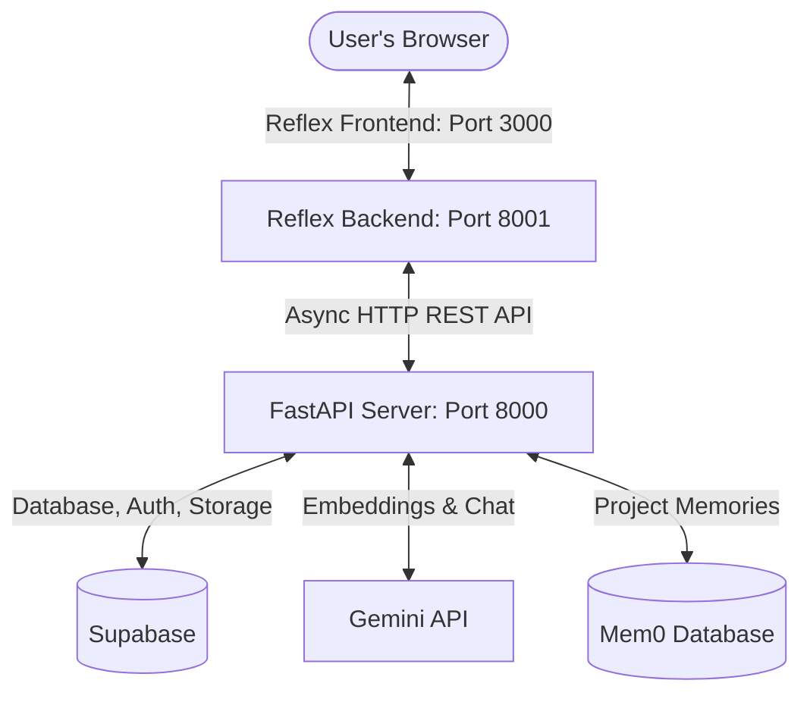

# SceneForge

SceneForge is a state-of-the-art, RAG-powered film research chatbot designed to help filmmakers, writers, and researchers search and query scripts and reference materials with zero hallucination and full source citations. It incorporates a decoupled architecture with a standalone FastAPI backend, a highly interactive Reflex frontend with premium glassmorphic styling, and long-term memory managed via Mem0.

---

## Architecture Overview



SceneForge is built on a **fully decoupled architecture**:
1. **Reflex Frontend (Ports 3000 & 8001):** Renders the UI and manages local state, making async HTTP requests to the FastAPI backend.
2. **FastAPI Backend (Port 8000):** Exposes 11 REST API endpoints for user authentication, project management, document retrieval, and chatbot RAG queries.
3. **Supabase:** Used for auth, metadata database, and PDF document storage.
4. **Gemini API & Mem0:** Powers vector embeddings, zero-hallucination script answers, and project-specific contextual memory.

---

## Local Setup & Configuration

### Prerequisites
- Python 3.11 or 3.12
- Node.js (Reflex will install it automatically inside its virtual sandbox if not present)

### 1. Clone & Setup Environment
Create and activate a virtual environment:
```bash
python3 -m venv venv
source venv/bin/activate
pip install -r requirements.txt
```

### 2. Configure Environment Variables
Create a `.env` file in the project root:
```env
# Supabase Configuration
SUPABASE_URL="https://your-project.supabase.co"
SUPABASE_KEY="your-supabase-anon-key"

# Gemini AI Configuration
GEMINI_API_KEY="your-gemini-api-key"

# Client/CORS Config
CORS_ALLOWED_ORIGINS="http://localhost:3000,http://127.0.0.1:3000,http://localhost:8001,http://127.0.0.1:8001"
SITE_URL="http://localhost:3000"

# App State Configurations (Optional overrides)
# BACKEND_URL="http://localhost:8000"
```

### 3. Initialize the Database
Execute the SQL statements in [supabase_schema.sql](file:///Users/shameekyogi/My%20Apps/ScriptForge/supabase_schema.sql) in your Supabase SQL editor to set up the necessary tables, indexes, and RLS policies.

---

## Running SceneForge Locally

To run the decoupled servers locally without port conflicts, run the FastAPI backend on port `8000` and the Reflex backend on port `8001`.

### Step 1: Start the FastAPI Backend
```bash
source venv/bin/activate
uvicorn backend.main:app --port 8000 --reload
```
The FastAPI documentation will be available at `http://localhost:8000/docs`.

### Step 2: Start the Reflex Frontend
In a new terminal window:
```bash
source venv/bin/activate
export API_URL="http://localhost:8001"
export BACKEND_URL="http://localhost:8000"
reflex run --backend-port 8001
```
The application UI will launch at `http://localhost:3000`.

---

## Running Tests

SceneForge contains a complete unit and integration test suite:
- `tests/test_rag.py`: Verifies PDF text extraction, overlapping text chunking, and LLM prompt builder logic.
- `tests/test_auth.py`: Verifies Supabase authentication wrapping, thread-safe database client caching, and user rate-limiting daily count resets.
- `tests/test_api.py`: Integrations tests exercising all 11 API endpoints using FastAPI's test client.

To run the test suite locally:
```bash
source venv/bin/activate
python -m unittest discover -s tests/
```

---

## Production & Docker Deployment

### 1. Build and Run via Docker
To package SceneForge in a production-ready container, use the provided Dockerfile. Note that environment variables are **not** baked into the container for security purposes:

```bash
# Build the Docker image
docker build -t sceneforge:latest .

# Run the container (bind mounts for uploads and database local configs)
docker run -d \
  -p 3000:3000 -p 8000:8000 \
  --env-file .env \
  -v $(pwd)/uploads:/app/uploads \
  -v $(pwd)/mem0:/app/mem0 \
  sceneforge:latest
```

### 2. Production Build Commands (Reflex)
When deploying the frontend to static hosting or app services, Reflex separates the static HTML export from the production runtime:
- **Build Frontend Bundle:** `reflex export --frontend-only` (Generates a zip of the built React/Next.js frontend inside `.web/_static`).
- **Run Production Backend Event Server:** `reflex run --env prod --backend-only`
